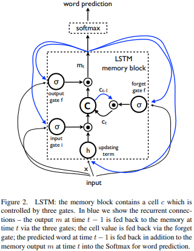
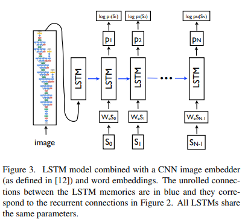

# Show and Tell: A Neural Image Caption Generator

## Abstract

 이미지의 내용을 스스로 설명하는 것은 컴퓨터 비전과 자연어 처리를 잇는 인공지능 분야에서 기본적인 문제이다. 본 논문에서, 우리는 발전된 컴퓨터 비전과 기계 번역을 결합한 *deep recurrent architecture*를 기반으로 한 생성 모델(*generative model*)을 소개하고, 이 모델이 이미지를 설명하는 문장을 생성할 수 있음을 보인다. 해당 모델은 주어진 학습 이미지에 대응하는 설명하는 문장이 등장하도록 하는 가능도(*likelihood*) 최대화하도록 학습한다. 여러 데이터 셋을 통한 실험으로 모델의 정확도와 이미지를 설명하는 문장을 토대로 학습한 언어의 유창함(자연스러움)을 확인할 수 있었다. 우리의 모델은 양적인 측면, 질적인 측면 모두의 검증 과정 중 많은 상황에서 정확한 모습을 보였다. 예를 들어 *Pascal* 데이터 셋에 대한 현재 최신의 *BLEU-1* 점수는 25점인 반면, 사람이 직접 수행한 점수는 69점과 비교하여 우리의 이러한 접근 방법은 59점을 기록했다. 또한 우리는 *Flickr 30k* 데이터 셋에 대한 *BLEU-1* 점수가 56점에서 66점으로 향상되는 결과를 보였고, *SBU* 데이터 셋 또한 19점에서 28점을 기록하는 성과를 보였습니다. 마지막으로 새롭게 발표된 *COCO* 데이터 셋에 대해 27.7점의 *BLEU-4* 점수를 기록했고, 이는 현재 가장 높은 기록이다.

## 1. Introduction

 정형화된 영어문장을 적절히 사용하여 이미지의 내용을 자동으로 설명하도록 하는 일은 상당히 힘들지만, 그만큼 지대한 영향을 미칠 수 있는 목표이다. 예를 들어, 시각에 문제가 있는 사람들에게 웹에 있는 이미지의 내용을 잘 이해하도록 도울 수 있다. 이러한 이미지 캡션은 컴퓨터 비전 분야에서 주로 다루는 이미지 분류 작업이나 물체 인식 작업과 비교하여 상당히 어려운 일이다. 실제로 설명이라는 것은 이미지에 존재하는 개체를 잡아내는 것 뿐만 아니라, 그들이 포함한 속성(*attributes*)과 동작(*activities*)과 더불어 개체들간의 관계까지도 표현해야 하는 작업이다. 거기에, 앞서 말한 의미적인 지식(*semantic knowledge*)이 영어와 같은 자연어로 표현되어야 하며, 이는 시각적인 이해 외에 언어 모델까지 필요하다는 것을 의미한다.

 앞선 대부분의 시도들은 이미지에서 이미지의 설명으로 이어지기 위해 해당 부분 문제들의 기존 해결 방안들을 결합하기를 선택했다. 이와는 대조적으로, 우리는 하나의 접합 모델로써, 입력으로 이미지 $$I$$를 가지고, 이미지를 적절히 설명하는 주어진 단어 집합에서 선택된 단어를 $$S_t$$라 할 때, 입력 이미지에 대응되는 단어 시퀀스인 $$S=\{S_1, S_2, \cdots\}$$ 를 생성할 가능도(*likelihood*)인 $$p(S|I)$$를 최대화하도록 학습하는 방향으로 나타내고자 했다.

 우리는 출발 언어로 쓰여진 문장 $$S$$에서 목적 언어로 쓰여진 문장 $$T$$로 $$p(T|S)$$를 최대화함으로써 변형시키는 최근 발전한 기계 번역 분야에서 영감을 주로 얻었다. 수 년 동안, 기계 번역은 일련의 개별 작업들(각각의 단어를 번역하고, 단어를 정렬하고, 재배열하는 등)으로 이루어졌으나, 최근 이러한 번역이 *Recurrent Neural Networks(RNNs)*를 사용한 간단한 방법을 통해 해결이 가능하며, 이것이 최고의 성능을 보인다는 성과를 얻었다. *encoder RNN*은 입력 문장(*source sentence*)을 읽어들여 이를 고정 길이의 벡터 표현으로 변환하며, 이는 출력 문장(*target sentence*)를 생성하는 *decoder RNN*의 초기 *hidden state*로서 사용된다.

 여기에, 우리는 *encoder RNN*을 *deep convolution network(CNN)*으로 대체하는 우아한 방법을 소개한다. 지난 몇 년 동안 CNN이 입력 이미지를 고정 길이를 가진 벡터에 임베딩함으로써 다양한 비전 작업에 사용할 수 있는 이미지의 풍부한 표현을 생성해낼 수 있음이 설득력있게 입증되었다. 그러므로 CNN을 이미지 "인코더"로써 사용하려는 시도는 자연스럽게 이뤄졌다. 이미지 분류 작업으로 미리 학습한 CNN의 마지막 레이어를 문장을 생성하는 RNN의 디코더의 입력으로 사용하는 이러한 모델을 *Neural Image Caption, NIC*이라 부른다.

 우리의 기여(Contribution)은 다음과 같다. 첫째로 우리는 문제를 종단간(end-to-end) 시스템형태인 SGD(stochastic gradient descent)를 사용하여 완전히 학습가능한 신경망으로 나타낸다. 두번째는, 우리의 모델을 비전 모델과 언어 모델의 최신 하위 네트워크를 결합하여 만들어냈다. 이는 거대한 말뭉치 데이터로 사전에 학습이 가능하며, 이것은 추가적인 데이터의 이점을 취할 수 있도록 한다. 마지막으로 최첨단의 접근 방법과 비교하여 우리의 모델은 훨씬 좋은 성능을 보인다. 예를 들어 Pascal 데이터셋에 대해 NIC 모델은 59점의 BLEU 스코어를 보였고, 이는 현재 최고 기술을 사용하여 25점을 기록한 것과 비교될만한 점수이다. 참고로 사람이 기록한 BLEU 스코어는 69점이다. Flickr 30k 데이터 셋에 대해서는 NIC는 56점에서 66점으로 향상된 점수를 보였으며, SBU 데이터 셋은 19점에서 28점으로의 상승을 보였다.

## 2. Related Work

## 3. Model

 이 논문에서는 이미지에서 설명을 생성하기 위해 신경의, 그리고 확률의 프레임워크를 제안한다. 통계적 기계 번역의 발전은 강력한 시퀀스 모델이 주어졌을 때, 주어진 입력 문장에 대해 정확한 번역 문장의 가능성을 최대화 시키는 방법을 통해 학습 환경과 추론 환경 모두에서 최고의 결과를 기록해냈다. 이러한 모델은 가변 길이의 입력을 고정된 차원을 가진 벡터로 인코딩하고 이것을 원하는 출력 문장으로 디코딩하는데 사용하는 *Recurrent Neural Network(RNN)*의 사용을 일궈냈다. 그러므로 이미지가 주어졌을 때(번역하고자 하는 언어의 문장이 주어지는 대신) 그 이미지에 대한 설명으로 번역하는데 적용하는 원칙을 적용해보는 것은 자연스럽게 행해졌다.

 따라서 우리는 주어진 이미지에 대한 올바른 설명의 가능성을 직접 최대화 하도록 다음 공식화를 통해 증명한다.
$$
\begin{align}
& \theta^*=\arg\max_{\theta}\sum_{(I,S)}\log{p(S|I;\theta)} & (1)
\end{align}
$$
 $$\theta$$는 모델의 파라미터이며, $$I$$는 이미지, $$S$$는 올바른 설명을 의미한다. $$S$$는 어느 문장이든 표현하기 때문에 길이는 정해져 있지 않다. 그러므로 $$N$$이 다음과 같은 예에서의 길이라 할 때, $$S_0, \cdots, S_N$$에 대한 결합된 확률을 모델링하기 위해 체인 룰(chain rule)을 적용하는 것이 일반적이다. 편의를 위해 $$\theta$$에 대한 종속성은 제거했다.  
$$
\begin{align}
&\log{p(S|I)}=\sum^{N}_{t=0}{\log{p(S_t|I, S_0, \dots, S_{t-1})}} & (2)
\end{align}
$$
 $$(S,I)$$는 학습 데이터 쌍이며, (2)에서 설명한 것처럼 우리는 확률의 로그 값들의 합을 최적화한다. 이러한 과정을 *SGD(stochastic gradient descent)*을 사용하여 전체 학습 데이터 셋에 대해 수행한다. (학습에 관한 자세한 사항은 Section 4에서 다룬다.)

 $$p(S_t|I,S_0,\dots,S_{t-1})$$을 자연스레 *Recurrent Neural Network(RNN)*으로 모델링하고, $$t-1$$까지 우리가 설정하는 가변적인 단어 수는 고정 길이의 hidden state 또는 메로리 $$h_t$$로 표현한다. 이 메모리는 아래 수식과 같이 비선형 함수인 $$f$$를 사용하여 새로운 입력 $$x_t$$를 관찰한 후에 업데이트 된다.
$$
\begin{align}
& h_{t+1} = f(h_t, x_t) & (3)
\end{align}
$$
 위에서 나타낸 RNN을 구체적으로 만들기 위해 두가지 중요한 설계 요소를 선택해야 했는데, 하나는 $$f$$에 정확한 형태이고, 다른 하나는 이미지와 단어를 입력 $$x_t$$에 어떻게 사용할지(*feed*)이다. 우리는 $$f$$의 모델링으로 번역 같은 시퀀스한 작업에서 최고의 성능을 보이는 *Long-Short Term Memory(LSTM)*을 사용하였다. 이 모델은 다음 Section에서 설명한다.

 이미지의 표현을 위해, 우리는 *Convolution Neural Network(CNN)*을 사용한다. CNN은 이미지 작언에서 널리 사용되고 연구되며, 오브젝트 인식과 탐지 분야에서 현재 최고의 성능을 보여준다. 특히 우리가 사용하기로 선택한 CNN은 배치 정규화(*batch normalization*)에서 새롭게 접근하여 현재 ILSVRC 2014 이미지 분류 대회에서 최고의 성능을 보인다. 게다가 이 CNN은 전이 학습(*transfer learning*)의 방법을 사용하여 장면 분류 같은 다른 작업에도 일반화하여 사용할 수 있음을 보였다. 단어의 경우는 임베딩 모델을 사용하여 표현하였다.

#### 3.1 LSTM-based Sentence Generator

 (3)에서 사용되는 $$f$$로 사용할 모델을 선택하는 것은 선택된 모델이 RNN 모델을 설계하고 학습하는데 있어 가장 어려운 장애물인 기울기 소실(*vanishing gradient*)과 기울기 폭주(*expliding gradient*)을 얼마나 잘 제어하는지에 달려있다. 이 어려움을 해결하기 위해 LSTM이라는 신경망 모델이 발표되었고, 번역과 시퀀스 데이터 생성 작업에 있어서 좋은 성공을 거뒀다.

 LSTM 모델의 핵심은 현재까지 진행한 모든 time step에서의 관찰된 입력에 관한 정보를 인코딩 하는 메모리 셀 $$c$$이다. 셀의 동작은 "게이트(Gates)"에 의해 제어된다. 레이어는 곱셈 연산에 의해 적용되기 때문에 게이트 값이 1일 때 레이어의 출력 값을 그대로 유지하거나 게이트 값이 0일 때 0이 되도록 한다.  LSTM 내부에 3개의 게이트가 존재하는데 각각은 현재의 셀 값을 잊을지 제어하는 forget gate $f$, 입력을 읽어야 하는지 결정하는 input gate $i$, 새로운 셀 값을 저장할지 결정하는 output gate $o$로 구성된다. 각 게이트들의 정의와 셀의 갱신, 그리고 출력은 다음과 같다.
$$
\begin{align}
& i_t=\sigma(W_{ix}x_t+W_{im}m_{t-1}) & (4) \\
& f_t=\sigma(W_{fx}x_t+W_{fm}m_{t-1}) & (5) \\
& o_t=\sigma(W_{ox}x_t+W_{om}m_{t-1}) & (6) \\
& c_t = f_t \odot c_{t-1} + i_t \odot h(W_{cx}x_t+W_{cm}m_{t-1}) & (7) \\
& m_t = o_t \odot c_t & (8) \\
& p_{t+1} = \text{Softmax}(m_t) & (9)
\end{align}
$$

이 때 $\odot$은 게이트 값과의 곱 연산을 나타내며, 행렬 $W$는 학습되는 파라미터를 나타낸다. 이러한 곱 연산을 사용한 게이트를 통해 기울기 폭주와 소실 문제가 발생하지 않고 LSTM이 잘 학습되는 것이 가능케한다. 비선형성을 가진 활성화 함수는 시그모이드($\sigma$)와 하이버볼릭 탄젠트($h$)를 사용하고, 마지막 식의 $m_t$는 Softmax의 인자로 사용되며 모든 단어에 대한 확률 분포를 계산한다.

**학습**

LSTM 모델은  $p(S_t|I,S_0,\dots,S_{t-1})$에 의해 정의된 이미지와 모든 단어를 통해 문장을 구성할 각 단어를 예측하도록 학습한다. 이를 위해, LSTM을 펼쳐진 형태로 생각하는 것이 편리하다. 이미지와 각 단어에 의해 연산되는 과정은 LSTM 메모리 셀의 복사본을 통해 연산되며 모든 LSTM은 같은 파라미터를 공유한다. 또한 LSTM의 $(t-1)$에서의 출력 $m_{t-1}$는 $t$에서의 입력으로 사용된다.(그림 3 참고) 모든 Recurrent한 연결은 펼쳐진 상태에서 feed-forward한 연결로 변형시켜 나타낼 수 있다. 자세히는, $i$를 입력 이미지 $S=(S_0,\dots,S_N)$을 이미지를 설명하는 문장이라고 나타낼 때 펼쳐진 상태에서 일어나는 절차를 아래와 같이 나타낼 수 있다.
$$
\begin{align}
& x_{-1}=\text{CNN}(I) & (10) \\
& x_t=W_eS_t, t \in \{0,\dots,N-1\} & (11) \\
& p_{t+1} = \text{LSTM}(x_t), t \in \{0, \dots, N-1\} & (12)
\end{align}
$$
위에서 각 단어는 학습에 사용되는 단어들을 포함한 딕셔너리와 같은 차원을 가진 원핫 벡터 $S_t$로 표현한다. 추가로 $S_0$은 문장의 시작을 알리는 특별한 시작 토큰으로, $S_N$은 문장의 끝을 알리는 특별한 끝 토큰으로 사용한다. 특히 LSTM은 이 끝 토큰을 생성함으로써 완성된 문장을 생성했음을 표현한다. 이미지와 단어들은 같은 차원 공간상으로 맵핑되도록 하는데, 이미지는 CNN을 통해, 단어들은 임베딩 행렬 $W_e$를 통해 맵핑된다. 이미지는 입력으로 $t=-1$일 때 단 한번만 사용된다. 우리는 경험을 통해 매 time step 마다 이미지를 입력으로 추가하여 사용하는 것이 오히려 나쁜 결과를 발생시킴을 확인했다. 이는 이미지에 존재하는 노이즈로 인해 발생하며 더 쉽게 과적합(Overfit)이 발생한다.

## 4. Experiments

## 5. Conclusion
