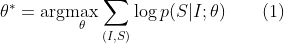
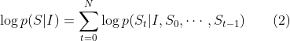

# Show and Tell: A Neural Image Caption Generator

## Abstract

 이미지의 내용을 스스로 설명하는 것은 컴퓨터 비전과 자연어 처리를 잇는 인공지능 분야에서 기본적인 문제이다. 본 논문에서, 우리는 발전된 컴퓨터 비전과 기계 번역을 결합한 *deep recurrent architecture*를 기반으로 한 생성 모델(*generative model*)을 소개하고, 이 모델이 이미지를 설명하는 문장을 생성할 수 있음을 보인다. 해당 모델은 주어진 학습 이미지에 대응하는 설명하는 문장이 등장하도록 하는 가능도(*likelihood*) 최대화하도록 학습한다. 여러 데이터 셋을 통한 실험으로 모델의 정확도와 이미지를 설명하는 문장을 토대로 학습한 언어의 유창함(자연스러움)을 확인할 수 있었다. 우리의 모델은 양적인 측면, 질적인 측면 모두의 검증 과정 중 많은 상황에서 정확한 모습을 보였다. 예를 들어 *Pascal* 데이터 셋에 대한 현재 최신의 *BLEU-1* 점수는 25점인 반면, 사람이 직접 수행한 점수는 69점과 비교하여 우리의 이러한 접근 방법은 59점을 기록했다. 또한 우리는 *Flickr 30k* 데이터 셋에 대한 *BLEU-1* 점수가 56점에서 66점으로 향상되는 결과를 보였고, *SBU* 데이터 셋 또한 19점에서 28점을 기록하는 성과를 보였습니다. 마지막으로 새롭게 발표된 *COCO* 데이터 셋에 대해 27.7점의 *BLEU-4* 점수를 기록했고, 이는 현재 가장 높은 기록이다.

## 1. Introduction

 정형화된 영어문장을 적절히 사용하여 이미지의 내용을 자동으로 설명하도록 하는 일은 상당히 힘들지만, 그만큼 지대한 영향을 미칠 수 있는 목표이다. 예를 들어, 시각에 문제가 있는 사람들에게 웹에 있는 이미지의 내용을 잘 이해하도록 도울 수 있다. 이러한 이미지 캡션은 컴퓨터 비전 분야에서 주로 다루는 이미지 분류 작업이나 물체 인식 작업과 비교하여 상당히 어려운 일이다. 실제로 설명이라는 것은 이미지에 존재하는 개체를 잡아내는 것 뿐만 아니라, 그들이 포함한 속성(*attributes*)과 동작(*activities*)과 더불어 개체들간의 관계까지도 표현해야 하는 작업이다. 거기에, 앞서 말한 의미적인 지식(*semantic knowledge*)이 영어와 같은 자연어로 표현되어야 하며, 이는 시각적인 이해 외에 언어 모델까지 필요하다는 것을 의미한다.

 앞선 대부분의 시도들은 이미지에서 이미지의 설명으로 이어지기 위해 해당 부분 문제들의 기존 해결 방안들을 결합하기를 선택했다. 이와는 대조적으로, 우리는 하나의 접합 모델로써, 입력으로 이미지 $I$를 가지고, 이미지를 적절히 설명하는 주어진 단어 집합에서 선택된 단어를 $S_t$라 할 때, 입력 이미지에 대응되는 단어 시퀀스인 $S=\{S_1, S_2, \cdots\}$ 를 생성할 가능도(*likelihood*)인 $p(S|I)$를 최대화하도록 학습하는 방향으로 나타내고자 했다.

 우리는 출발 언어로 쓰여진 문장 $S$에서 목적 언어로 쓰여진 문장 $T$로 $p(T|S)$를 최대화함으로써 변형시키는 최근 발전한 기계 번역 분야에서 영감을 주로 얻었다. 수 년 동안, 기계 번역은 일련의 개별 작업들(각각의 단어를 번역하고, 단어를 정렬하고, 재배열하는 등)으로 이루어졌으나, 최근 이러한 번역이 *Recurrent Neural Networks(RNNs)*를 사용한 간단한 방법을 통해 해결이 가능하며, 이것이 최고의 성능을 보인다는 성과를 얻었다. *encoder RNN*은 입력 문장(*source sentence*)을 읽어들여 이를 고정 길이의 벡터 표현으로 변환하며, 이는 출력 문장(*target sentence*)를 생성하는 *decoder RNN*의 초기 *hidden state*로서 사용된다.

 여기에, 우리는 *encoder RNN*을 *deep convolution network(CNN)*으로 대체하는 우아한 방법을 소개한다. 지난 몇 년 동안 CNN이 입력 이미지를 고정 길이를 가진 벡터에 임베딩함으로써 다양한 비전 작업에 사용할 수 있는 이미지의 풍부한 표현을 생성해낼 수 있음이 설득력있게 입증되었다. 그러므로 CNN을 이미지 "인코더"로써 사용하려는 시도는 자연스럽게 이뤄졌다. 이미지 분류 작업으로 미리 학습한 CNN의 마지막 레이어를 문장을 생성하는 RNN의 디코더의 입력으로 사용하는 이러한 모델을 *Neural Image Caption, NIC*이라 부른다.

 우리의 기여(Contribution)은 다음과 같다. 첫째로 우리는 문제를 종단간(end-to-end) 시스템형태인 SGD(stochastic gradient descent를 사용하여 완전히 학습가능한 신경망으로 나타낸다. 두번째는, 우리의 모델을 비전 모델과 언어 모델의 최신 하위 네트워크를 결합하여 만들어냈다. 이는 거대한 말뭉치 데이터로 사전에 학습이 가능하며, 이것은 추가적인 데이터의 이점을 취할 수 있도록 한다. 마지막으로 최첨단의 접근 방법과 비교하여 우리의 모델은 훨씬 좋은 성능을 보인다. 예를 들어 Pascal 데이터셋에 대해 NIC 모델은 59점의 BLEU 스코어를 보였고, 이는 현재 최고 기술을 사용하여 25점을 기록한 것과 비교될만한 점수이다. 참고로 사람이 기록한 BLEU 스코어는 69점이다. Flickr 30k 데이터 셋에 대해서는 NIC는 56점에서 66점으로 향상된 점수를 보였으며, SBU 데이터 셋은 19점에서 28점으로의 상승을 보였다.

## 2. Related Work

## 3. Model

 이 논문에서는 이미지에서 설명을 생성하기 위해 신경의, 그리고 확률의 프레임워크를 제안한다. 통계적 기계 번역의 발전은 강력한 시퀀스 모델이 주어졌을 때, 주어진 입력 문장에 대해 정확한 번역 문장의 가능성을 최대화 시키는 방법을 통해 학습 환경과 추론 환경 모두에서 최고의 결과를 기록해냈다. 이러한 모델은 가변 길이의 입력을 고정된 차원을 가진 벡터로 인코딩하고 이것을 원하는 출력 문장으로 디코딩하는데 사용하는 *Recurrent Neural Network(RNN)*의 사용을 일궈냈다. 그러므로 이미지가 주어졌을 때(번역하고자 하는 언어의 문장이 주어지는 대신) 그 이미지에 대한 설명으로 번역하는데 적용하는 원칙을 적용해보는 것은 자연스럽게 행해졌다.

 따라서 우리는 주어진 이미지에 대한 올바른 설명의 가능성을 직접 최대화 하도록 다음 공식화를 통해 증명한다.

$\theta$는 모델의 파라미터이며, $I$는 이미지, $S$는 올바른 설명을 의미한다. $S$는 어느 문장이든 표현하기 때문에 길이는 정해져 있지 않다. 그러므로 $N$이 다음과 같은 예에서의 길이라 할 때, $S_0, \cdots, S_N$에 대한 결합된 확률을 모델링하기 위해 체인 룰(chain rule)을 적용하는 것이 일반적이다. 편의를 위해 $\theta$에 대한 종속성은 제거했다.  

학습에서, $(S,I)$는 학습 데이터 쌍이며, (2)에서 설명한 것처럼 우리는 확률의 로그 값들의 합을 최적화한다. 이러한 과정을 SGD(stochastic gradient descent)을 사용하여 전체 학습 데이터 셋에 대해 수행한다. (학습에 관한 자세한 사항은 Section 4에서 다룬다.)

## 4. Experiments

## 5. Conclusion
